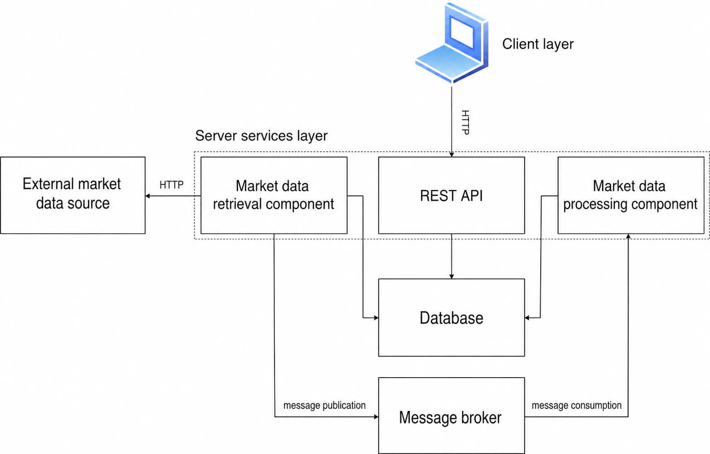

# StockViewer


Full-stack, event-driven stock analytics and paper-trading platform with an Angular UI, Spring Boot API, and Go scheduler.

## Highlights

- **Event-driven pipeline:** Go scheduler pulls Binance OHLC data, persists to PostgreSQL, and publishes Kafka events consumed by Spring to calculate MACD, EMA9, and MACD signal indicators.
- **Secure REST API:** JWT auth with endpoints for users, candles, trades, wallets, and watchlists.
- **Trading workflow:** Paper trades with wallet tracking and trade history.
- **Production-style setup:** Docker Compose orchestration with Nginx serving the frontend.

  
  


  


## Core workflow

- Go scheduler ingests market data and emits indicator events through Kafka.
- Spring Boot API persists and aggregates candle data, indicators, and user portfolio state.
- Angular UI renders charts, watchlists, and trading actions via the REST API.

## Architecture

| Component | Tech | Responsibility |
| --- | --- | --- |
| Frontend | Angular 20, TypeScript, lightweight-charts, Chart.js | Candlestick charts, watchlists, and trading UI |
| API service | Spring Boot 3.4, Java 21 | Auth, candle data, trades, wallets, indicators, watchlists |
| Scheduler service | Go 1.21 | Scheduled market data ingestion and Kafka event publishing |
| Data & messaging | PostgreSQL 15, Kafka 3.7 | Persistence and indicator event pipeline |



## Quick start (Docker Compose)

Docker is the only requirement for running the full stack locally (no local JDK/Go/Node toolchains needed).

1. Copy environment defaults and adjust secrets as needed:
   ```bash
   cp .env_example .env
   ```
2. Run:
   ```bash
   docker compose up --build -d
   ```
3. Open the UI at `http://localhost/` and the API at `http://localhost:8080/` (direct) or `http://localhost/api/v1/` via the Nginx reverse proxy.

## API documentation

- OpenAPI spec: `documentation/resources/endpoints.yaml`

## Project structure

- `stock_frontend/` — Angular application
- `stock_api_service/` — Spring Boot REST API
- `stock_scheduler_service/` — Go scheduler and data ingestion
- `documentation/` — requirements, mockups, endpoints, and diagrams
- `docker-compose.yml` — local orchestration

## Documentation

- `documentation/requirements.md` — functional and non-functional requirements
- `documentation/resources/schema.sql` — database schema
- `documentation/resources/endpoints.yaml` — API spec
